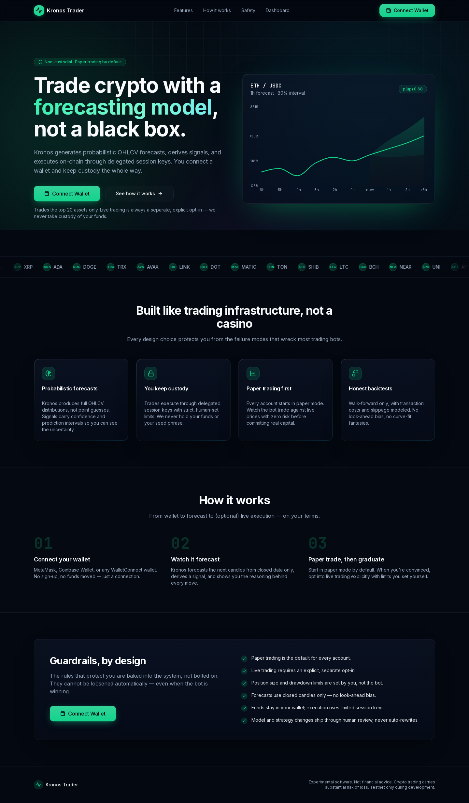
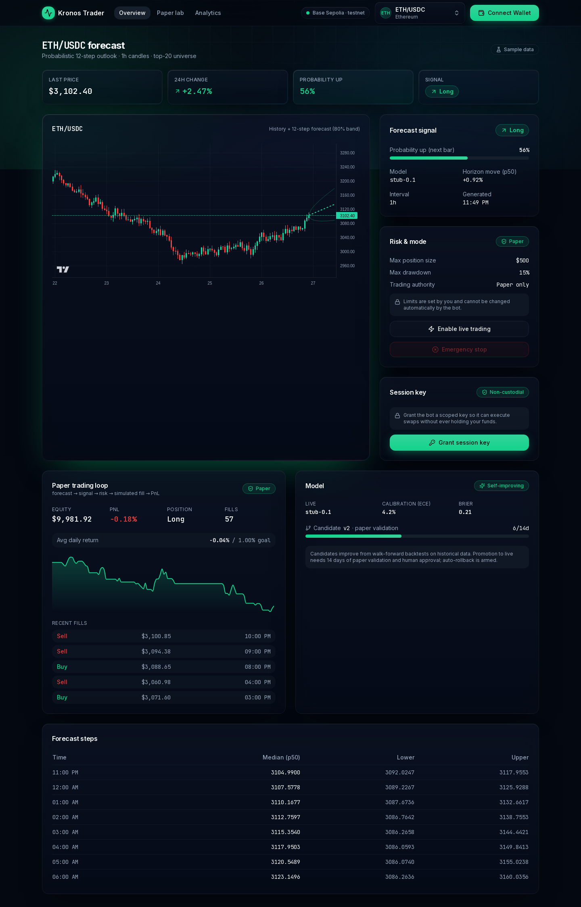
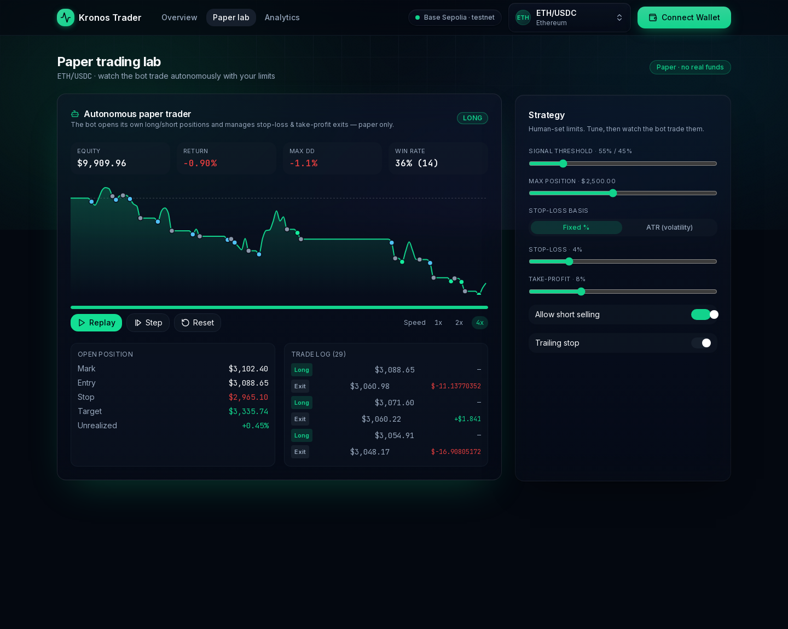
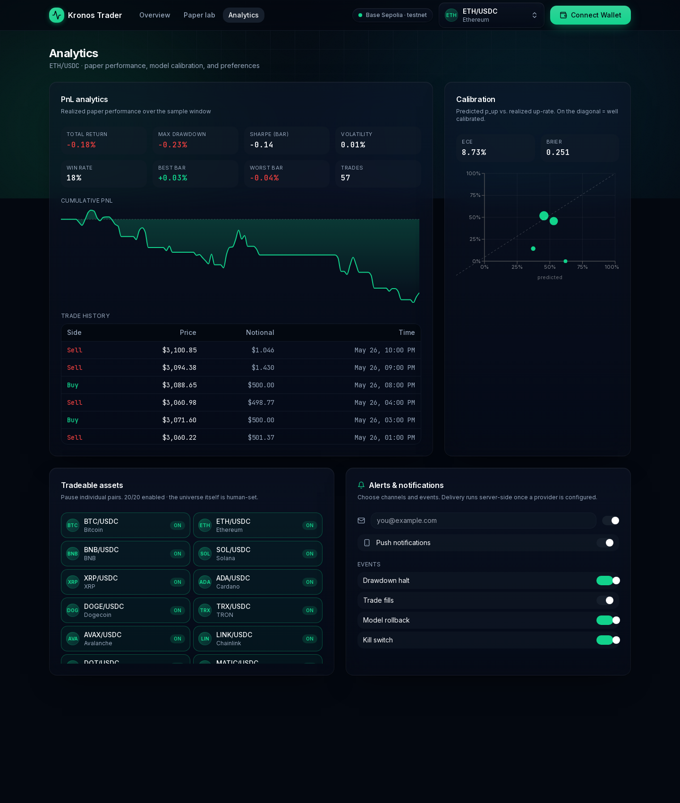

# Kronos Trader

A **non-custodial** crypto trading web app powered by the [Kronos](https://github.com/shiyu-coder/Kronos)
foundation model. You connect a wallet, the bot generates probabilistic OHLCV
forecasts, derives long/short signals, and (optionally) executes on-chain through
delegated session keys — **you keep custody the entire way**, and every account
starts in **paper mode** by default.



> **Status:** active development. Live/mainnet trading is gated behind explicit,
> human opt-in and is not enabled by default. Treat this as research software —
> see [Safety & invariants](#safety--invariants) and the [disclaimer](#disclaimer).

---

## Highlights

- **Probabilistic forecasts.** Kronos produces full OHLCV distributions with
  prediction intervals — not point guesses. Forecasts use **closed candles only**
  (no look-ahead bias).
- **Autonomous paper trading.** The bot opens its own long/short positions and
  manages **stop-loss / take-profit** exits (fixed-percent or volatility-scaled
  **ATR** stops), within human-set limits. Try it live in the **Paper lab**.
- **Honest backtesting.** Walk-forward only, with transaction costs and slippage
  modeled. Bootstrap confidence intervals, a sign-flip permutation test, and a
  **Deflated Sharpe Ratio** flag overfit parameter sweeps.
- **Confidence- & volatility-aware sizing.** Kelly-capped, vol-targeted position
  sizing that only ever scales *within* the human-set cap.
- **Calibration tracking.** A reliability diagram (with ECE and Brier score)
  checks whether "70% up" really closes up ~70% of the time.
- **Operational safety.** A human kill-switch, drawdown/rollback alerting, and
  per-asset enable/disable.
- **Non-custodial by design.** Trades execute via delegated session keys with
  strict, human-set spend limits; the app never holds your funds or seed phrase.

---

## Screenshots

### Dashboard
Live forecast chart, signal, risk & mode, session key, and the paper-trading loop.



### Paper lab — autonomous trading
Watch the bot trade autonomously: play / pause / step through the data, with a
live equity curve (trade markers), an open-position panel (entry / stop / target /
unrealized), a trade log, and human-set strategy controls.



### Analytics
PnL analytics + trade history, the model calibration curve, per-asset
enable/disable, and notification preferences.



---

## Architecture

A pnpm + Python monorepo:

| Path | Stack | Purpose |
| --- | --- | --- |
| `apps/web` | Next.js 14 (App Router), TypeScript, Tailwind, wagmi/viem, Recharts, Framer Motion | The web app: landing, dashboard, paper lab, analytics |
| `apps/api` | FastAPI, Pydantic v2, SQLModel, SIWE auth | Auth, forecasts, backtests, paper loop, risk, ops |
| `apps/ml`  | FastAPI (GPU) | Hosts Kronos and serves structured forecasts |
| `packages/shared` | TypeScript types | Single source of truth for API contracts |

Core backend modules live under `apps/api/src/`: `signals/` (policy, sizing,
factors, regime), `risk/` (limits, stops, ATR), `execution/` (paper loop, broker),
`backtest/` (engine, folds, validation, deflated Sharpe), `improve/` (sweeps,
calibration, registry), and `ops/` (kill-switch, alerts, notifications).

---

## Prerequisites

- **Node.js ≥ 20** and **pnpm 10** (`corepack enable` to get pnpm)
- **Python ≥ 3.11** (for `apps/api` and `apps/ml`)
- Optional for full backend: **PostgreSQL + TimescaleDB** and **Redis**
  (the API uses SQLite in dev/tests, so these are not required just to run the app)
- A free [WalletConnect Cloud](https://cloud.walletconnect.com) project id for wallet connect

---

## Install

```bash
# 1. Clone
git clone https://github.com/classamusic-spec/testagent1.git
cd testagent1

# 2. Configure environment (placeholders only — never commit real secrets)
cp .env.example .env
#   then edit .env (at minimum set NEXT_PUBLIC_WALLETCONNECT_PROJECT_ID)

# 3. Install JS workspace deps
pnpm install

# 4. (Optional) Python backends
cd apps/api && python -m venv .venv && source .venv/bin/activate \
  && pip install -e ".[dev]" && cd ../..
cd apps/ml  && python -m venv .venv && source .venv/bin/activate \
  && pip install -e ".[dev]" && cd ../..
```

> The dashboard runs against **deterministic sample data** when the API isn't
> reachable, so you can explore the full UI (including the Paper lab) with just
> the web app running.

---

## Run

**Web app** (from the repo root):

```bash
pnpm dev          # http://localhost:3000
```

**API** (optional — from `apps/api`, venv active):

```bash
uvicorn src.main:app --reload --port 8000
```

**ML / Kronos service** (optional — from `apps/ml`, venv active):

```bash
uvicorn src.main:app --reload --port 8001
```

---

## Usage

1. **Open** `http://localhost:3000` and **Connect Wallet** (MetaMask / Coinbase /
   WalletConnect). You stay in **paper mode** — no funds are ever moved.
2. **Dashboard** — pick an asset to see the live forecast chart, the derived
   signal, and the paper-trading loop.
3. **Paper lab** (`/dashboard/paper`) — tune the strategy (signal threshold, max
   position, **stop-loss % or ATR-based stop**, take-profit, allow-short,
   trailing), then **Play** to watch the bot autonomously open/close longs and
   shorts and get stopped out / take profit. Trade markers appear on the equity
   curve and in the trade log.
4. **Analytics** (`/dashboard/analytics`) — review PnL/trade history, the model
   calibration curve, toggle assets on/off, and set alert preferences.
5. **Go live** is a separate, explicit opt-in with a risk confirmation — never a
   default.

---

## Testing

```bash
pnpm test                     # all JS/TS tests (Vitest)
pnpm typecheck && pnpm build  # type-check and build the workspace

# Python (from apps/api or apps/ml, venv active)
pytest
ruff check . && black --check . && mypy src
```

`apps/api/src/execution/` and `apps/api/src/risk/` are money-path code and are
covered by unit + integration tests.

---

## Safety & invariants

This project encodes hard rules (see [`CLAUDE.md`](CLAUDE.md)). The most important:

- **Paper mode is the default** for every user; live trading requires an explicit,
  separate opt-in.
- **Forecasts use closed candles only** — no look-ahead bias.
- **Position size, drawdown, and trading authority limits are human-set** and are
  never modified at runtime based on performance. The bot's stop-losses and sizing
  operate strictly *within* these limits.
- **No LLM or RL sits in the trade-decision path.** The pipeline is deterministic
  (forecast → signal → sizing → stops → risk). LLMs are only used to *explain*
  trades to users.
- **Secrets never enter the repo.** Configure them in `.env` (gitignored);
  `.env.example` documents the variables with placeholders only.
- **No mainnet RPC / non-testnet exchange APIs** are hit in development.

---

## Disclaimer

Kronos Trader is experimental research software. Cryptocurrency trading carries
substantial risk of loss. Nothing here is financial advice. Use paper trading,
testnets, and tiny sizes; you are solely responsible for any funds you put at
risk. No warranty of any kind is provided.
